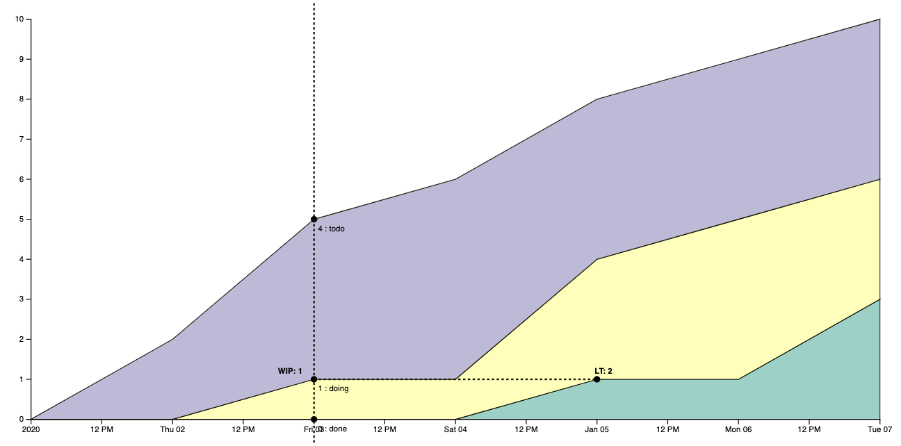

# NG-CFD

> WORK IN PROGRESS, do not use it yet.

This is the simple interactive React component for [Cumulative Flow Diagrams](https://en.wikipedia.org/wiki/Cumulative_flow_diagram) built with [d3](https://d3js.org/).

## Introduction

Project inspired by [Cfd](https://github.com/aslakhellesoy/cfd). 
Most part of the code is from this project. Big thanks to Aslak Hellesøy.

## Changes

- Bumped dependencies
- Added WIP limits settings (which statuses are used for WIP limits)
- Added hover tooltips (WIP, LT, CNT)
- Fixed LT calculation
- Added setup LT setting to calculate

## Example

[Demo](https://alexrett.github.io/ng-cfd)



## How to use it

Install `npm i ng-cfd`

Use it in your project:
```ts
import {CFD} from "ng-cfd";

export const Stat = () => {
    const data = [
        {
            timestamp: new Date(2021, 1, 1),
            todo: 0,
            done: 0,
            doing: 0,
        },
        {
            timestamp: new Date(2021, 1, 2),
            todo: 3,
            doing: 0,
            done: 0,
        },
        {
            timestamp: new Date(2021, 1, 3),
            todo: 3,
            doing: 2,
            done: 0,
        },
    ]

    return <CFD width={300} height={300} from={'doing'} to={'done'} data={data} keys={['todo', 'doing', 'done']} wipKeys={['doing', 'done']}/>
}
```

